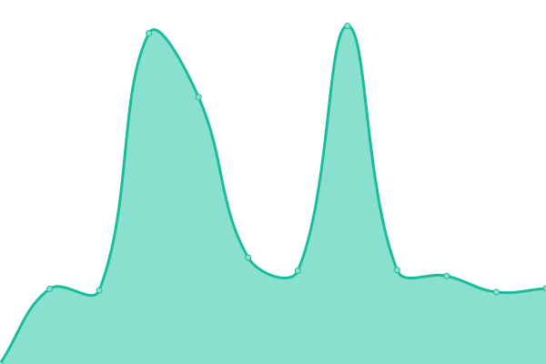
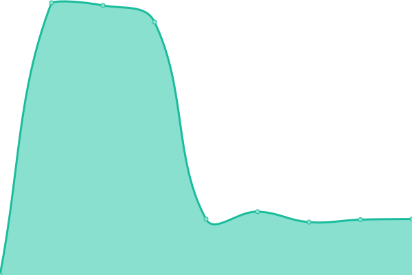
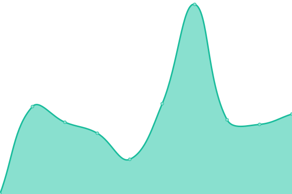

# [📈 Live Status](https://status.fixator10.ru): <!--live status--> **🟩 All systems operational**

This repository contains the open-source uptime monitor and status page for [Fixator10](https://fixator10.ru), powered by [Upptime](https://github.com/upptime/upptime).

With [Upptime](https://upptime.js.org), you can get your own unlimited and free uptime monitor and status page, powered entirely by a GitHub repository. We use [Issues](https://github.com/fixator10/status/issues) as incident reports, [Actions](https://github.com/fixator10/status/actions) as uptime monitors, and [Pages](https://status.fixator10.ru) for the status page.

<!--start: status pages-->
<!-- This summary is generated by Upptime (https://github.com/upptime/upptime) -->
<!-- Do not edit this manually, your changes will be overwritten -->
<!-- prettier-ignore -->
| URL | Status | History | Response Time | Uptime |
| --- | ------ | ------- | ------------- | ------ |
|  [Fixator10](https://fixator10.ru) | 🟩 Up | [fixator10.yml](https://github.com/fixator10/status/commits/HEAD/history/fixator10.yml) | 

 1202ms
     
 | 

<a href="https://status.fixator10.ru/history/fixator10">62.12%</a>
    

|  [Ene: Static](https://ene.fixator10.ru) | 🟩 Up | [ene-static.yml](https://github.com/fixator10/status/commits/HEAD/history/ene-static.yml) | 

 1168ms
     
 | 

<a href="https://status.fixator10.ru/history/ene-static">62.12%</a>
    

|  [Ene: Stats (Grafana)](https://ene.fixator10.ru/stats/api/health) | 🟩 Up | [ene-stats-grafana.yml](https://github.com/fixator10/status/commits/HEAD/history/ene-stats-grafana.yml) | 

 1090ms
     
 | 

<a href="https://status.fixator10.ru/history/ene-stats-grafana">62.12%</a>
    

|  Ene: Stats (DB) | 🟩 Up | [ene-stats-db.yml](https://github.com/fixator10/status/commits/HEAD/history/ene-stats-db.yml) | 

 1189ms
     
 | 

<a href="https://status.fixator10.ru/history/ene-stats-db">62.12%</a>
    

|  [Ene: Dashboard](https://ene.fixator10.ru/dash/) | 🟩 Up | [ene-dashboard.yml](https://github.com/fixator10/status/commits/HEAD/history/ene-dashboard.yml) | 

 1188ms
     
 | 

<a href="https://status.fixator10.ru/history/ene-dashboard">62.12%</a>
    

<!--end: status pages-->

[**Visit our status website →**](https://status.fixator10.ru)

## 📄 License

- Code: [MIT](./LICENSE) © [Fixator10](https://fixator10.ru)
- Data in the `./history` directory: [Open Database License](https://opendatacommons.org/licenses/odbl/1-0/)
