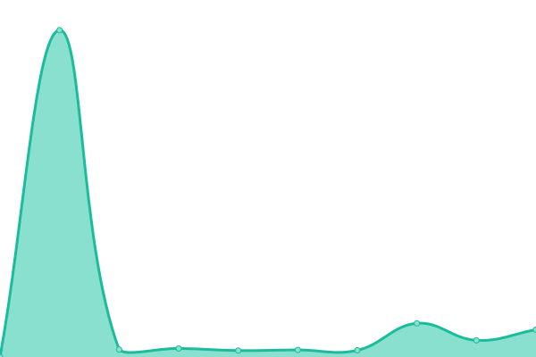
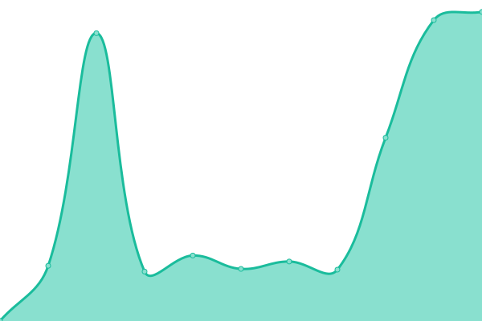
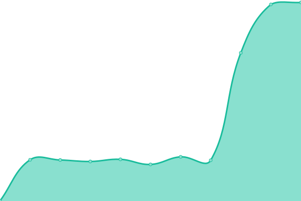
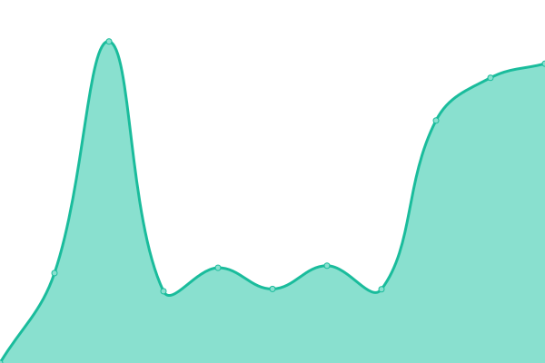

# [📈 Live Status](https://status.fixator10.ru): <!--live status--> **🟩 All systems operational**

This repository contains the open-source uptime monitor and status page for [Fixator10](https://fixator10.ru), powered by [Upptime](https://github.com/upptime/upptime).

With [Upptime](https://upptime.js.org), you can get your own unlimited and free uptime monitor and status page, powered entirely by a GitHub repository. We use [Issues](https://github.com/fixator10/status/issues) as incident reports, [Actions](https://github.com/fixator10/status/actions) as uptime monitors, and [Pages](https://status.fixator10.ru) for the status page.

<!--start: status pages-->
<!-- This summary is generated by Upptime (https://github.com/upptime/upptime) -->
<!-- Do not edit this manually, your changes will be overwritten -->

| URL                                                               | Status | History                                                                                                   | Response Time                                                                          | Uptime                                                                                                                                                                                                                         |
| ----------------------------------------------------------------- | ------ | --------------------------------------------------------------------------------------------------------- | -------------------------------------------------------------------------------------- | ------------------------------------------------------------------------------------------------------------------------------------------------------------------------------------------------------------------------------ |
| [Fixator10](https://fixator10.ru)                                 | 🟩 Up  | [fixator10.yml](https://github.com/fixator10/status/commits/master/history/fixator10.yml)                 |  688ms         |                  |
| [Ene: Static](https://ene.fixator10.ru)                           | 🟩 Up  | [ene-static.yml](https://github.com/fixator10/status/commits/master/history/ene-static.yml)               |  750ms        |                |
| [Ene: Stats (Grafana)](https://ene.fixator10.ru/stats/api/health) | 🟩 Up  | [ene-stats-grafana.yml](https://github.com/fixator10/status/commits/master/history/ene-stats-grafana.yml) |  423ms |  |
| Ene: Stats (DB)                                                   | 🟩 Up  | [ene-stats-db.yml](https://github.com/fixator10/status/commits/master/history/ene-stats-db.yml)           |  402ms      |            |
| [Ene: Dashboard](https://enedash.fixator10.ru)                    | 🟩 Up  | [ene-dashboard.yml](https://github.com/fixator10/status/commits/master/history/ene-dashboard.yml)         |  786ms     |          |

<!--end: status pages-->

[**Visit our status website →**](https://status.fixator10.ru)

## 📄 License

- Code: [MIT](./LICENSE) © [Fixator10](https://fixator10.ru)
- Data in the `./history` directory: [Open Database License](https://opendatacommons.org/licenses/odbl/1-0/)
